# Vending Machine System - High Level Flow Diagram

## System Architecture Overview

```mermaid
graph TB
    %% User Interface Layer
    subgraph "🎮 User Interface"
        CLI[CLI Interface<br/>bin/vending_machine_cli.rb]
        DEMO[Demo Script<br/>bin/demo.rb]
    end

    %% Core Business Logic Layer
    subgraph "🏪 Core Vending Machine"
        VM[VendingMachine<br/>lib/vending_machine.rb]
        PP[PaymentProcessor<br/>lib/payment_processor.rb]
        PV[PaymentValidator<br/>lib/payment_validator.rb]
    end

    %% Session Management Layer
    subgraph "📋 Session Management"
        SM[SessionManager<br/>lib/session_manager.rb]
        SUSM[SingleUserSessionManager<br/>lib/single_user_session_manager.rb]
        PS[PaymentSession<br/>lib/payment_session.rb]
    end

    %% Data Models Layer
    subgraph "📦 Data Models"
        ITEM[Item<br/>lib/item.rb]
        CHANGE[Change<br/>lib/change.rb]
    end

    %% Styling
    classDef userInterface fill:#e1f5fe,stroke:#01579b,stroke-width:2px,color:#000
    classDef coreLogic fill:#f3e5f5,stroke:#4a148c,stroke-width:2px,color:#000
    classDef sessionMgmt fill:#e8f5e8,stroke:#1b5e20,stroke-width:2px,color:#000
    classDef dataModels fill:#fff3e0,stroke:#e65100,stroke-width:2px,color:#000

    class CLI,DEMO userInterface
    class VM,PP,PV coreLogic
    class SM,SUSM,PS sessionMgmt
    class ITEM,CHANGE dataModels

    %% Connections
    CLI --> VM
    DEMO --> VM
    VM --> PP
    VM --> SUSM
    PP --> PV
    SUSM --> PS
    VM --> ITEM
    VM --> CHANGE
    PP --> CHANGE
```



## Detailed Purchase Flow

```mermaid
flowchart TD
    %% Start
    START([User Initiates Purchase]) --> CHOICE{Choose Method}

    %% Legacy Method
    CHOICE -->|Legacy API| LEGACY[Legacy purchase_item<br/>Single Payment]
    CHOICE -->|Session API| SESSION[Session-based API<br/>Multiple Payments]

    %% Legacy Flow
    subgraph "🔄 Legacy Purchase Flow"
        LEGACY --> VALIDATE_LEGACY[PaymentValidator.validate_purchase]
        VALIDATE_LEGACY --> CHECK_ITEM{Item Available?}
        CHECK_ITEM -->|No| ERROR_ITEM[Return: "Item not available"]
        CHECK_ITEM -->|Yes| CHECK_DENOM{Valid Denominations?}
        CHECK_DENOM -->|No| ERROR_DENOM[Return: "Invalid denominations"]
        CHECK_DENOM -->|Yes| CHECK_AMOUNT{Sufficient Payment?}
        CHECK_AMOUNT -->|No| ERROR_AMOUNT[Return: "Need more payment"]
        CHECK_AMOUNT -->|Yes| PROCESS_LEGACY[PaymentProcessor.process_payment]
        PROCESS_LEGACY --> UPDATE_BALANCE[Update Machine Balance]
        UPDATE_BALANCE --> DECREMENT_ITEM[Decrement Item Quantity]
        DECREMENT_ITEM --> RETURN_SUCCESS[Return Success + Change]
    end

    %% Session Flow
    subgraph "📋 Session Purchase Flow"
        SESSION --> START_SESSION[VendingMachine.start_purchase]
        START_SESSION --> CREATE_SESSION[SingleUserSessionManager.start_session]
        CREATE_SESSION --> PAYMENT_LOOP{Insert Payment}
        PAYMENT_LOOP --> ADD_PAYMENT[SessionManager.add_payment]
        ADD_PAYMENT --> CHECK_SUFFICIENT{Sufficient Funds?}
        CHECK_SUFFICIENT -->|No| MORE_PAYMENT[Return: "Need more payment"]
        MORE_PAYMENT --> PAYMENT_LOOP
        CHECK_SUFFICIENT -->|Yes| COMPLETE_SESSION[SessionManager.complete_session]
        COMPLETE_SESSION --> PROCESS_SESSION[PaymentProcessor.process_payment]
        PROCESS_SESSION --> UPDATE_BALANCE_SESSION[Update Machine Balance]
        UPDATE_BALANCE_SESSION --> DECREMENT_ITEM_SESSION[Decrement Item Quantity]
        DECREMENT_ITEM_SESSION --> RETURN_SUCCESS_SESSION[Return Success + Change]
    end

    %% Styling
    classDef startEnd fill:#ffebee,stroke:#c62828,stroke-width:3px,color:#000
    classDef decision fill:#fff8e1,stroke:#f57f17,stroke-width:2px,color:#000
    classDef process fill:#e8f5e8,stroke:#2e7d32,stroke-width:2px,color:#000
    classDef error fill:#ffebee,stroke:#c62828,stroke-width:2px,color:#000
    classDef success fill:#e1f5fe,stroke:#0277bd,stroke-width:2px,color:#000

    class START startEnd
    class CHOICE,CHECK_ITEM,CHECK_DENOM,CHECK_AMOUNT,PAYMENT_LOOP,CHECK_SUFFICIENT decision
    class LEGACY,SESSION,VALIDATE_LEGACY,PROCESS_LEGACY,UPDATE_BALANCE,DECREMENT_ITEM,START_SESSION,CREATE_SESSION,ADD_PAYMENT,COMPLETE_SESSION,PROCESS_SESSION,UPDATE_BALANCE_SESSION,DECREMENT_ITEM_SESSION process
    class ERROR_ITEM,ERROR_DENOM,ERROR_AMOUNT error
    class RETURN_SUCCESS,RETURN_SUCCESS_SESSION,MORE_PAYMENT success
```

## Payment Processing Details


## Session Management Flow


## Data Flow Architecture

```mermaid
graph LR
    %% Data Flow
    subgraph "📥 Input Layer"
        USER_INPUT[User Input<br/>Item Name + Payment]
        CLI_INPUT[CLI Commands]
    end

    subgraph "🏗️ Business Logic Layer"
        VM_LOGIC[VendingMachine Logic]
        PP_LOGIC[Payment Processing]
        VALIDATION_LOGIC[Validation Logic]
    end

    subgraph "💾 Data Layer"
        ITEM_DATA[(Item Data<br/>name, price, quantity)]
        BALANCE_DATA[(Balance Data<br/>coin denominations)]
        SESSION_DATA[(Session Data<br/>accumulated payments)]
    end

    subgraph "📤 Output Layer"
        SUCCESS_OUTPUT[Success Messages]
        ERROR_OUTPUT[Error Messages]
        CHANGE_OUTPUT[Change Calculation]
    end

    %% Connections
    USER_INPUT --> VM_LOGIC
    CLI_INPUT --> VM_LOGIC
    VM_LOGIC --> PP_LOGIC
    PP_LOGIC --> VALIDATION_LOGIC
    VALIDATION_LOGIC --> ITEM_DATA
    VALIDATION_LOGIC --> BALANCE_DATA
    PP_LOGIC --> SESSION_DATA
    PP_LOGIC --> SUCCESS_OUTPUT
    VALIDATION_LOGIC --> ERROR_OUTPUT
    PP_LOGIC --> CHANGE_OUTPUT

    %% Styling
    classDef inputLayer fill:#e3f2fd,stroke:#1565c0,stroke-width:2px,color:#000
    classDef businessLayer fill:#f3e5f5,stroke:#7b1fa2,stroke-width:2px,color:#000
    classDef dataLayer fill:#fff3e0,stroke:#ef6c00,stroke-width:2px,color:#000
    classDef outputLayer fill:#e8f5e8,stroke:#388e3c,stroke-width:2px,color:#000

    class USER_INPUT,CLI_INPUT inputLayer
    class VM_LOGIC,PP_LOGIC,VALIDATION_LOGIC businessLayer
    class ITEM_DATA,BALANCE_DATA,SESSION_DATA dataLayer
    class SUCCESS_OUTPUT,ERROR_OUTPUT,CHANGE_OUTPUT outputLayer
```



## Key Design Principles

### 🎯 SOLID Principles Applied

1. **Single Responsibility Principle (SRP)**
   - `VendingMachine`: Orchestrates the overall process
   - `PaymentProcessor`: Handles payment processing logic
   - `PaymentValidator`: Validates payments and items
   - `SessionManager`: Manages purchase sessions
   - `Item`: Represents product data
   - `Change`: Manages coin denominations

2. **Open/Closed Principle (OCP)**
   - Session management is extensible (can add multi-user support)
   - Payment validation can be extended with new rules
   - Change calculation supports different coin denominations

3. **Liskov Substitution Principle (LSP)**
   - `SingleUserSessionManager` can substitute `SessionManager`
   - Different payment processors can be injected

4. **Interface Segregation Principle (ISP)**
   - Clean interfaces between components
   - Minimal coupling between modules

5. **Dependency Inversion Principle (DIP)**
   - High-level modules don't depend on low-level modules
   - Dependencies are injected (e.g., `PaymentProcessor`, `SessionManager`)

### 🔄 Flow Summary

1. **User Interface**: CLI provides two interaction modes (legacy and session-based)
2. **Session Management**: Supports multi-step payments with session tracking
3. **Payment Processing**: Validates and processes payments with change calculation
4. **Data Management**: Maintains item inventory and machine balance
5. **Error Handling**: Comprehensive validation with clear error messages

The system follows a clean architecture pattern with clear separation of concerns, making it extensible and maintainable while supporting both simple and complex purchase scenarios.
